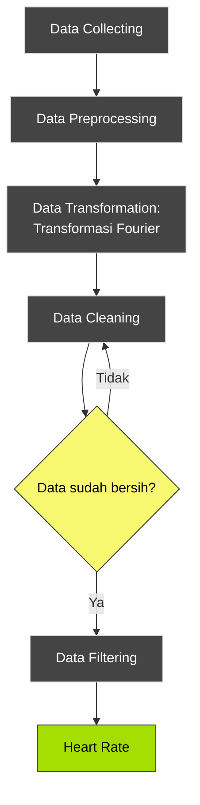

```mermaid
flowchart TD
    classDef process fill:#444444,stroke:#ddd,color:#fff,stroke-width:1px;
    classDef decision fill:#f9f871,stroke:#333,color:#000,stroke-width:1px;
    classDef output fill:#a4de02,stroke:#333,color:#000,stroke-width:1px;

    A[Data Collecting]:::process --> B[Data Preprocessing]:::process
    B --> C[Data Transformation:<br>Transformasi Fourier]:::process
    C --> D[Data Cleaning]:::process
    D --> E{Data sudah bersih?}:::decision

    E -- Ya --> F[Data Filtering]:::process
    F --> G[Heart Rate]:::output

    E -- Tidak --> D

```
