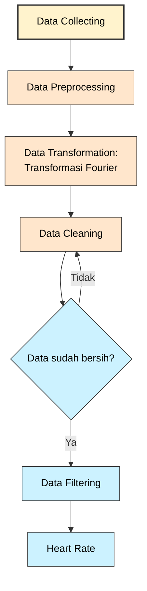

```mermaid
flowchart TD
  A[Data Collecting]
  B1[Data Preprocessing]
  C1[Data Transformation:<br>Transformasi Fourier]
  C2[Data Cleaning]
  B2{Data sudah bersih?}
  C3[Data Filtering]
  C4[Heart Rate]

  %% Alur
  A --> B1
  B1 --> C1
  C1 --> C2
  C2 --> B2
  B2 -- Ya --> C3
  C3 --> C4
  B2 -- Tidak --> C2

  %% Assign classes
  class B1,C1,C2 background;
  class B2,C3,C4 background2;
  class A title;

  %% Define background styles
  classDef background fill:#ffe6cc,color:#000,stroke:#333,stroke-width:1px;
  classDef background2 fill:#ccf2ff,color:#000,stroke:#333,stroke-width:1px;
  classDef title fill:#fff3cd,color:#000,stroke:#333,stroke-width:2px;


```
